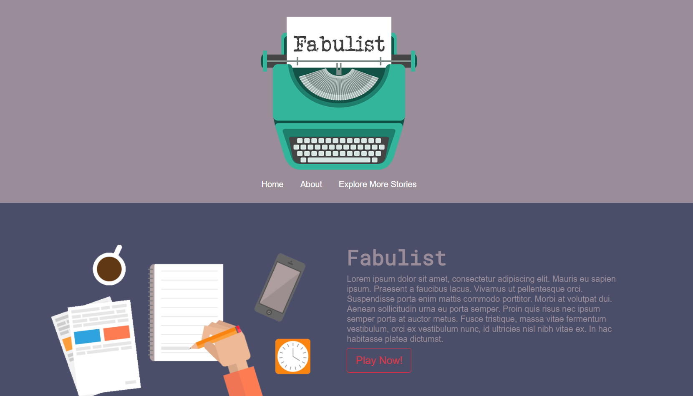

# Fabulist



***Fabulist*** is a collaborative story telling game in the style of [Exquisite Corpse](https://en.wikipedia.org/wiki/Exquisite_corpse), the parlor game [Consequences](https://en.wikipedia.org/wiki/Consequences_(game)) and [Mad Libs](https://en.wikipedia.org/wiki/Mad_Libs).  Any number of people can play. Fabulist is a game where participants take turns writing paragraphs of a story. If a player wants, they can draw an illustration in their turn instead of writing a paragraph. After each player has gone three times, Fabulist stitches the parts together into one story.  Hilarity ensues.</span>

## Deployed


## Built With
  - [Node.js](https://nodejs.org/en/download/) Open source server framework for using JavaScript
  - [Express](https://www.npmjs.com/package/express) Web server framework for Node.js
  - [Body-parser](https://www.npmjs.com/package/express) Request body parsing middleware for Node.js
  - [Dotenv](https://www.npmjs.com/package/dotenv) Used to obscure passwords and keys
  - [MySQL](https://www.mysql.com/downloads/) Open source relational database management system
  - [Sequelize](https://www.npmjs.com/package/sequelize) Used here as an ORM to the MySQL database
  - [Express-fileupload](https://www.npmjs.com/package/express-fileupload)  Express middleware for uploading files
  - [S3](https://www.npmjs.com/package/s3) Creates a client for Amazon AWS S3 for uploading and downloading image files


## Authors

* [Jerridd Speidel](https://github.com/TowerGuy2909) UI and modals
* [Maiyer Thao](https://github.com/jaethao) Graphic design and drawing component
* [Craig Christensen](https://github.com/ruffcorn33) Database - Framework, MySQL, AWS S3 and AWS Polly
* [Joe Semlak](https://github.com/semlak) Testing
* [Cristina Zhang](https://github.com/rami0141) Gameplay

<br>

### **Requirements**
Users must have [git](https://git-scm.com/book/en/v2/Getting-Started-Installing-Git), [MySQL](https://www.mysql.com/downloads/) and [Node.js](https://nodejs.org/en/download/) installed before completing these instructions.
~~Users must also follow the steps in `AWS User Setup` before installing Fabulist.~~<br>


## **Installing Fabulist**

1) From git bash, Terminal or Command Prompt, clone this repository to a directory on your computer.


git clone https://github.com/rami0141/Fabulist

## change to the application directory

```
cd Fabulist
```

## install the required packages
```
npm install
```

Users will need to add a file named '.env' to the project folder.
Add these lines to the file:
```
MYSQL_PASSWORD=?????????
MYSQL_USERNAME=?????????
```

Replace the question marks with your MySQL password and username (without these variables, the app will still try to run with default user is root, and password as NULL)<br>
Replace the question marks for the AWS fields with your secret access key and access key ID obtained above in `AWS User Setup Steps`.  If you named your S3 bucket something other than 'fabulist-images', replace that for the S3BUCKET field.


## **Setting up the MySQL database**

1) Log in to MySQL Workbench.  From the home screen, create a new connection by clicking the + symbol beside 'MySQL Connections'.  Name the connection 'fabulist_db'.

2) Click the new connection box to open it.  From the File menu, select 'Open SQL Script'.  Navigate to your project folder/db and select schema.sql.  Run the code to create the database.

3) To seed database,
 ```
    npm run seed
 ```


## **npm scripts**

## run server
```
npm start
```
## run tests (see below)
```
npm test
```
## initialize database and seed with sample data
```
npm run seed
```
## or, from project root
```
node db/seedWithSequelize
```
## reinitialize databases with Sequelize Models (doesn't populate tables)
```
npm run syncDBModels
```

## Running Tests
To run tests:
```
npm test
```

Note that right now the data that is inserted during tests is not removed. You can avoid messing up your main production and development database by switching to the test database (make sure to create 'database_test') before running tests.


 load test environment variable, which forces tests to use 'development_test' database. Make sure you have created it first.
```
export NODE_ENV=test
npm test
```

Setting the NODE_ENV variable like that is specific to each terminal, so you can run tests in one terminal using the database_test database, but have your development server running in another terminal agains the fabulist_db database. To swith the environment variable back:

```
export NODE_ENV=test
```
 or just close terminal


Note that although karma is installed, we are having problems when trying to run tests with Karma that involve using the database connection, so the tests should be run manually (`npm test).

### **AWS User Setup Steps:**
(Since neither the drawing component nor the text-to-speech componenet are funtional yet, these instructions are not needed in this version of Fabulist.  Will become relevant again when we need to store static files.)

Users will need to add these fields to the '.env' file:
```
AWS_SECRET_ACCESS_KEY=??????????????????????????????????????????
AWS_ACCESS_KEY_ID=?????????????????
S3BUCKET=fabulist-images (or your bucket name if different)
```

(These instructions are modified from fishcharlie's instructions here: [ExpressFileUploadS3Example](https://github.com/fishcharlie/ExpressFileUploadS3Example)) 
1.  Create an [Amazon Web Services (AWS)](https://aws.amazon.com) account.
2.  Once at the main AWS dashboard search for the `IAM` service or scroll down to find the `IAM` service and select that.
3.  On the left panel of the `IAM` service select `Users`.
4.  Click `Add user` at the top of the screen.
5.  Enter a `User name` in the text field. This can be anything (ex. `webuser`, `s3user`, `appkey`, etc.)
6.  Click the check box next to `Programmatic access`.
7.  Click `Next: Permissions`.
8.  Select `Attach existing policies directly`.
9.  In the search field right below that type in `S3`.
10. Click on the check box next to `AmazonS3FullAccess`.
11. Scroll down and click on the `Next: Review` button.
12. Click `Create user`.
13. This will display a table with your `Access key ID` and `Secret access key`. You will need to click the `Show` button to view your `Secret access key`. **!!! Important: this is the *only* time you will be able to see your secret access key without regenerating it, so please be sure to save it somewhere secure. !!!**


**AWS S3 Bucket Creation:**

1.  Go to the main AWS dashboard.
2.  Search for or scroll down to select `S3`.
3.  Click `Create bucket`.
4.  Give your bucket a unique name. The default is 'fabulist-images'.
5.  Select the region you wish to store your bucket data in.
6.  Click `Next`.
7.  The next panel allows you to set custom properties for your bucket. For now we will use the default settings so click `Next`.
8.  Under the drop down for `Manage public permissions` select `Not Public`.
9.  Click `Next`.
10. Click `Create bucket`.

For more information about setting up AWS S3, go [here](https://aws.amazon.com/documentation/s3/).<br><br>


## Copyright

All code (C) Exhausted_Bootcampers;